# 단디온나 백엔드 아키텍처 시각화

> 본 문서는 현재(AS-IS) 아키텍처와 개선 목표(TO-BE) 아키텍처를 Mermaid 다이어그램으로 시각화합니다.

---

## 1. 시스템 전체 구조 (AS-IS)

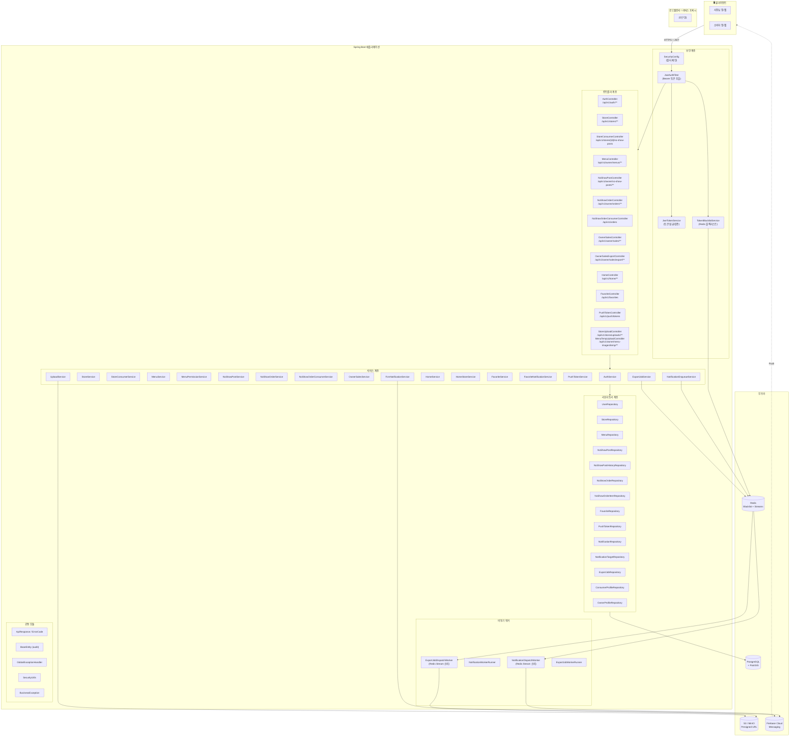

---

## 2. 패키지 구조 & 의존 관계 (AS-IS)

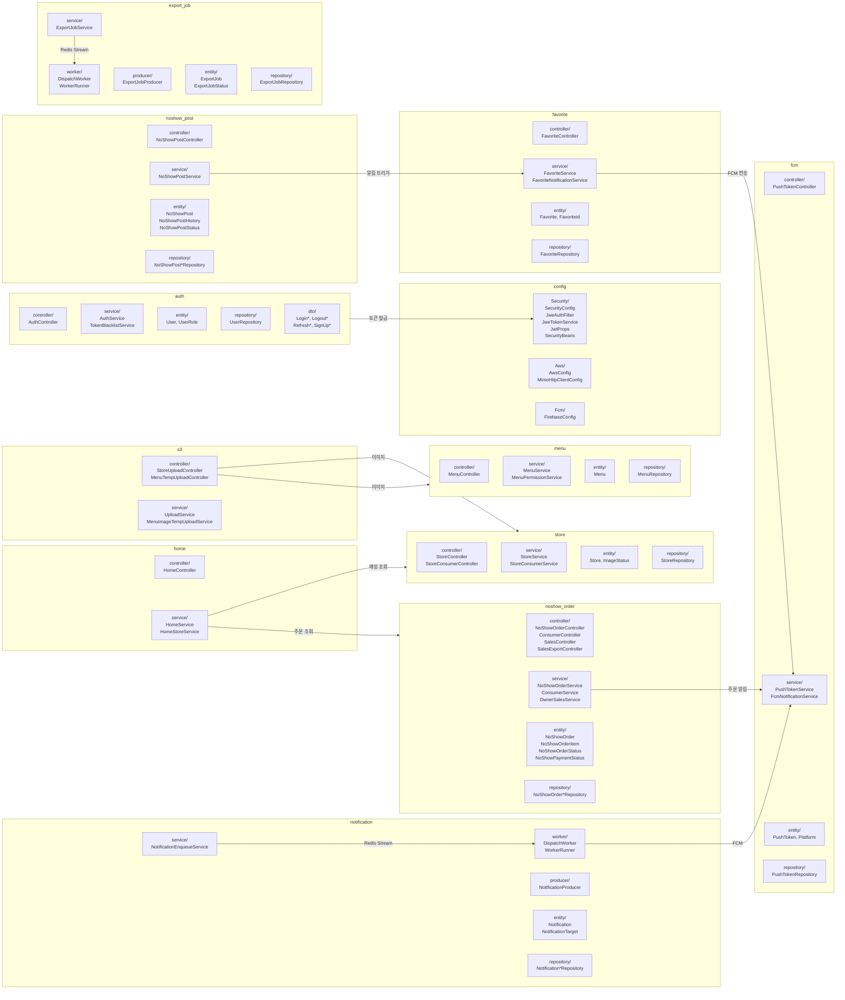

---

## 3. 데이터 흐름 (핵심 시나리오)

### 3-1. 인증 흐름

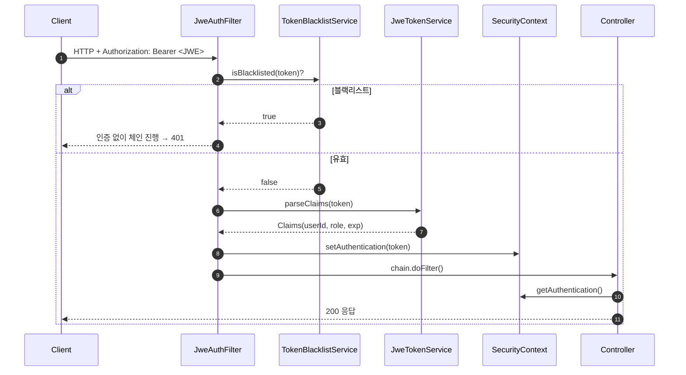

### 3-2. 노쇼 주문 & 알림 흐름

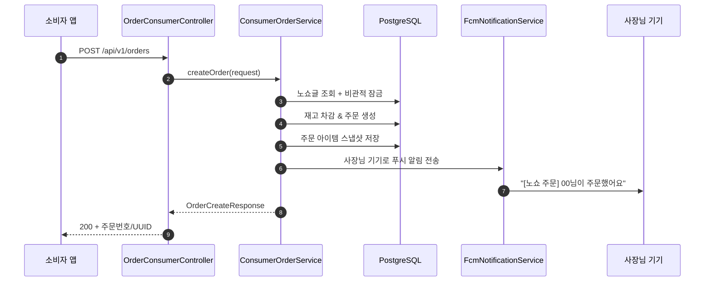

### 3-3. 이미지 업로드 흐름

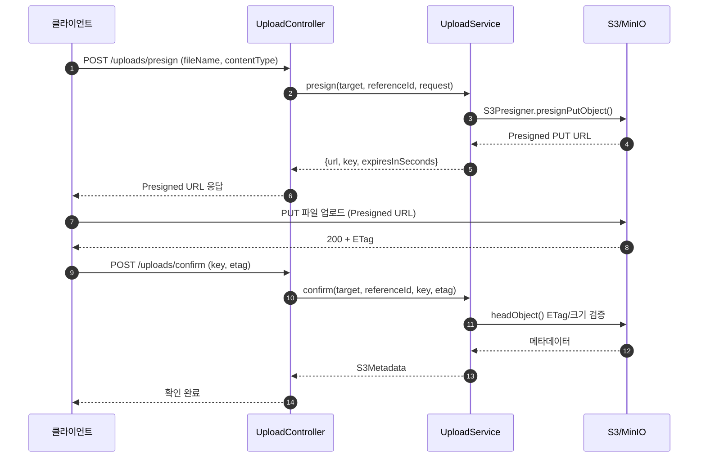

### 3-4. 비동기 알림 워커 흐름

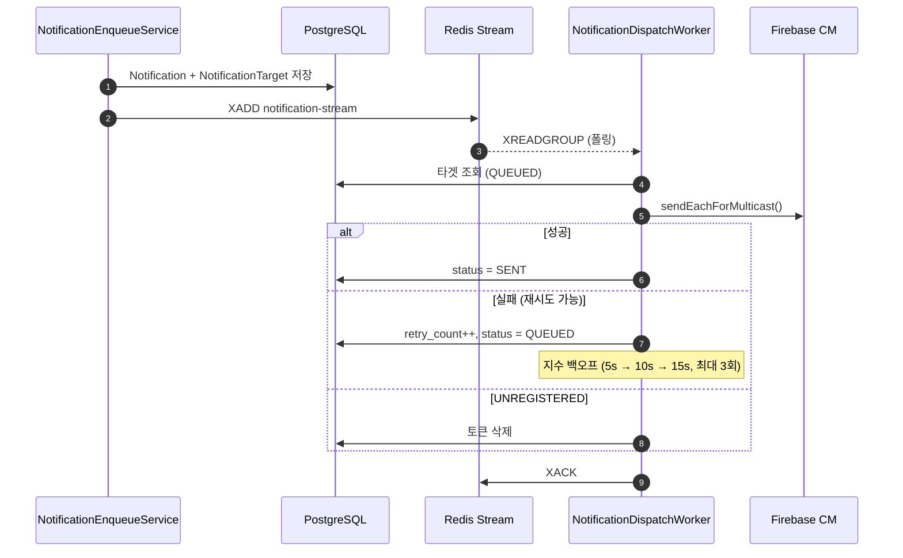

### 3-5. 매출 엑셀 Export 흐름

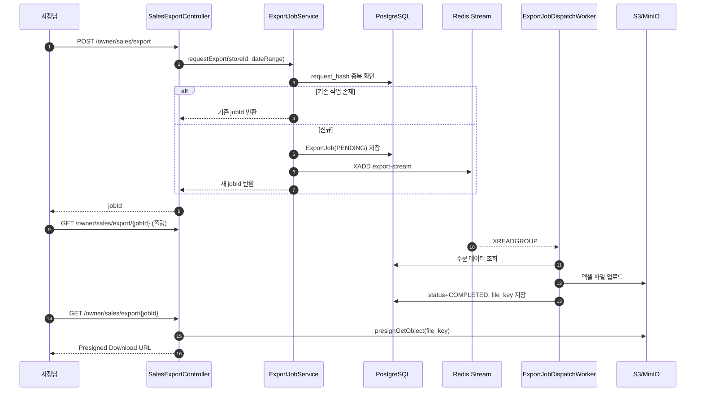

---

## 4. 역할 기반 접근 제어 (AS-IS)

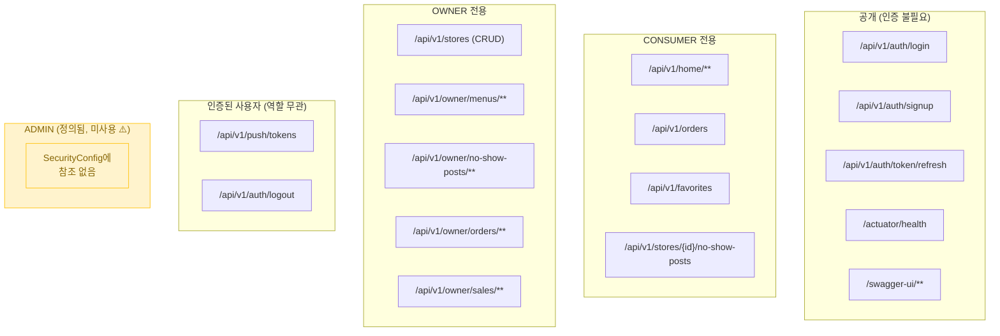

---

## 5. 보안 분석 요약 (AS-IS)

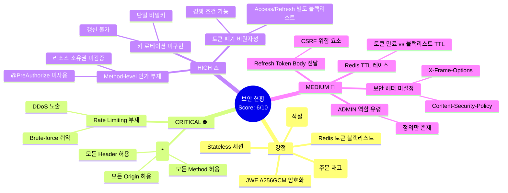

---

## 6. 목표 아키텍처 (TO-BE) — 전체 시스템

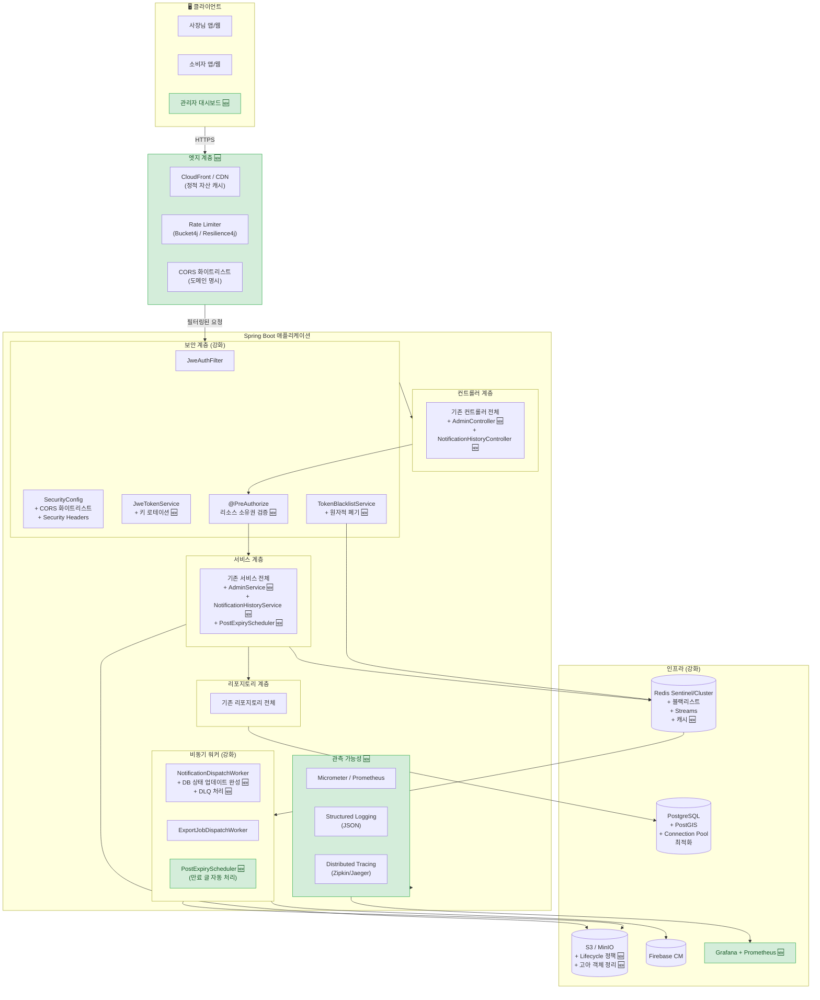

---

## 7. 개선 항목 상세 (TO-BE 로드맵)

### 7-1. 보안 강화 — CORS & Rate Limiting

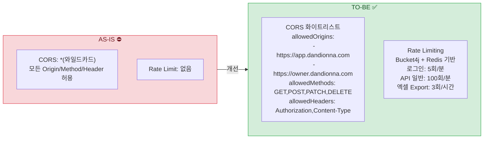

### 7-2. 보안 강화 — 키 로테이션 & 토큰 관리

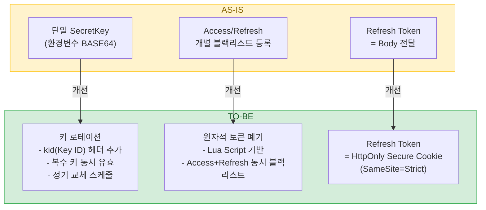

### 7-3. 권한 강화 — Method-level Authorization

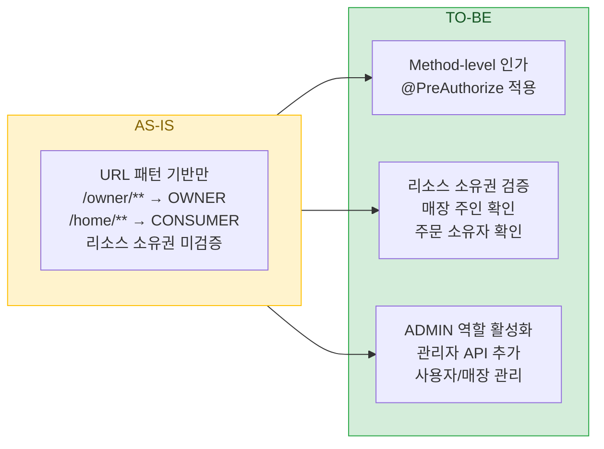

### 7-4. 인프라 & 운영 강화

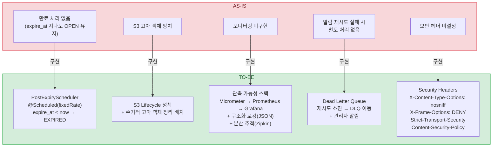

### 7-5. DTO & 검증 통일

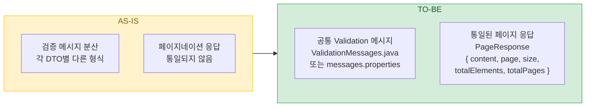

---

## 8. 데이터베이스 ERD (AS-IS)

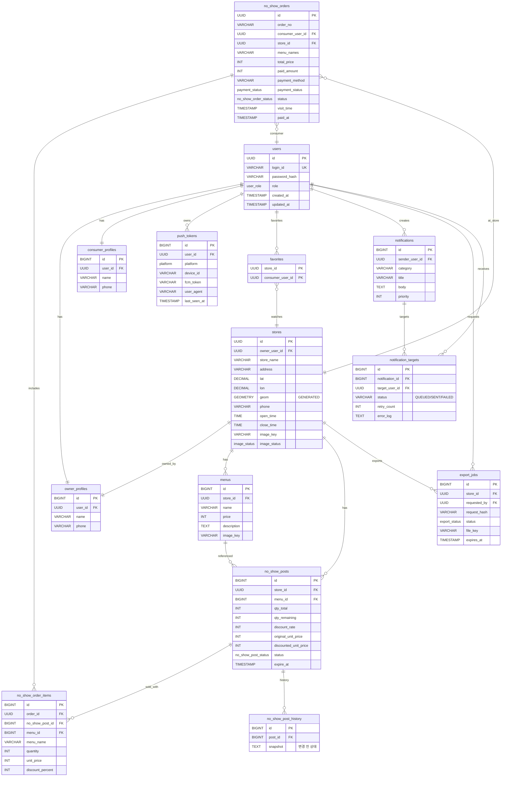

---

## 9. 개선 우선순위 매트릭스

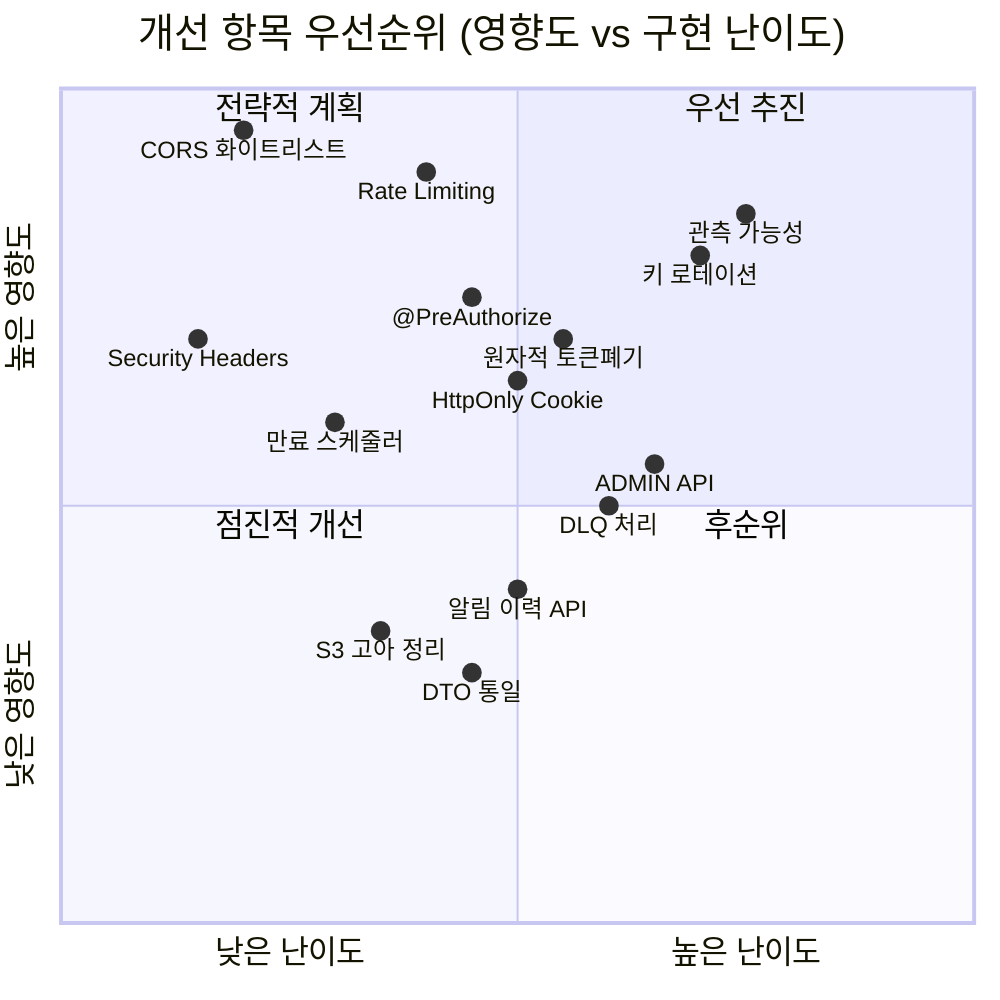

---

## 10. 구현 단계별 로드맵

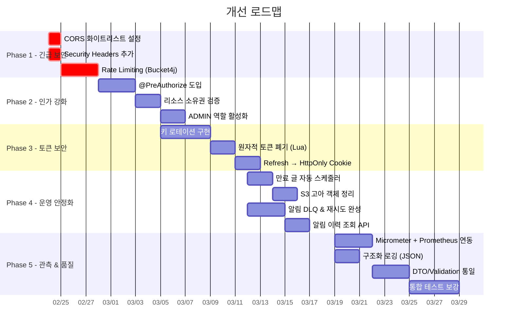

---

## 부록: 기술 스택 요약

| 구분 | AS-IS | TO-BE (제안) |
|------|-------|-------------|
| **Language** | Java 17 | Java 17+ |
| **Framework** | Spring Boot 3.x | Spring Boot 3.x |
| **Auth** | JWE (A256GCM) | JWE + 키 로테이션 + HttpOnly Cookie |
| **DB** | PostgreSQL + PostGIS | + Connection Pool 최적화 |
| **Cache/Queue** | Redis (Blacklist + Streams) | Redis Sentinel/Cluster + 캐시 계층 |
| **Storage** | S3/MinIO | + Lifecycle 정책 + 정리 배치 |
| **Push** | Firebase CM (직접 호출 + 워커) | + DLQ + 재시도 완성 |
| **보안** | URL 패턴 인가, CORS *, 헤더 없음 | 화이트리스트, @PreAuthorize, 보안 헤더 |
| **모니터링** | 없음 | Prometheus + Grafana + 구조화 로깅 |
| **Rate Limit** | 없음 | Bucket4j + Redis |
| **CI/CD** | GitHub Actions (테스트만) | + 빌드/배포 파이프라인 |
