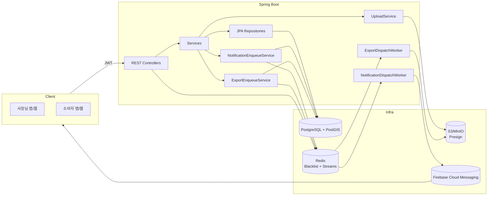

# 아키텍처 (Mermaid)

## 흐름 요약
- JWT 인증 후 사장/소비자 API 호출
- 노쇼 주문/즐겨찾기 알림 → **Redis Stream** 큐 → 워커가 FCM 전송
- 이미지 업로드: Presign → 클라이언트 업로드 → Confirm/ETag 검증
- Redis는 토큰 블랙리스트 및 알림 큐에 사용
- 매출 엑셀 내보내기: **비동기 작업(ExportJob)** → Redis Stream → 워커가 파일 생성 후 Presign URL 제공
