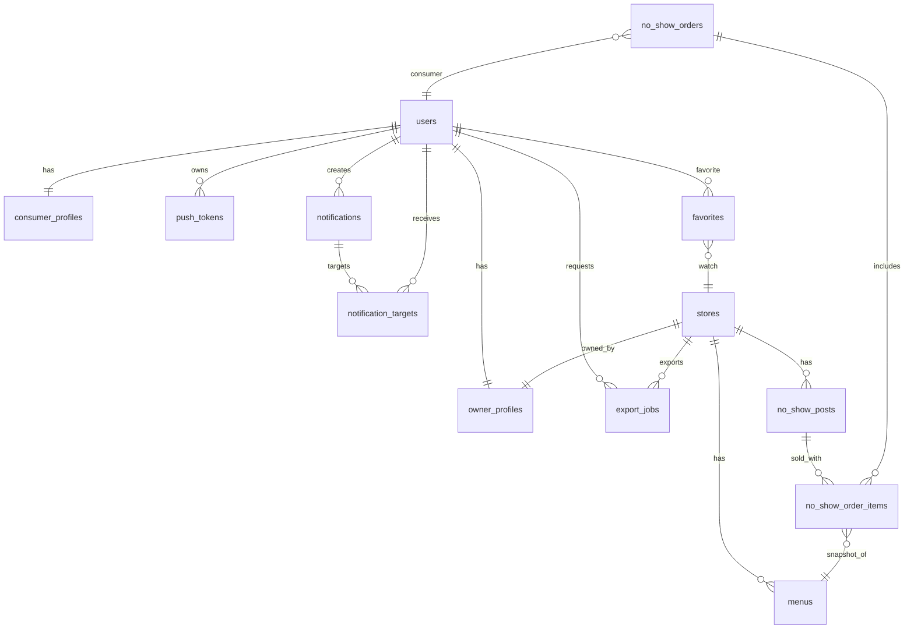

# Database & ERD (최종)

> 본 문서는 실제 운영 정보를 노출하지 않도록 **샘플/비식별** 형식으로 작성합니다.

## 핵심 테이블
- **users**: id(UUID), login_id, password_hash, role(CONSUMER/OWNER/ADMIN)
- **owner_profiles / consumer_profiles**: 사용자 상세(이름, 전화번호 등)
- **stores**: 매장 정보(+ PostGIS `geom` generated, 영업시간, 이미지 메타)
- **menus**: 매장 메뉴(가격, 설명, 이미지 메타)
- **no_show_posts**: 노쇼 판매글(할인율, qty_remaining, expire_at, status)
- **no_show_post_history**: 변경 이력 저장
- **no_show_orders**: 노쇼 주문 헤더(UUID PK, order_no, menu_names, paid_amount, payment_method, status)
- **no_show_order_items**: 주문 아이템 스냅샷(menu_name, quantity, unit_price, discount_percent, visit_time)
- **favorites**: 소비자 즐겨찾기(store_id, consumer_user_id)
- **push_tokens**: FCM 토큰(플랫폼/디바이스/토큰)
- **notifications / notification_targets**: 알림 발송 이력, 재시도/상태 관리
- **export_jobs**: 엑셀 내보내기 작업 이력(요청 해시, 상태, file_key, 만료)

## ERD (요약 Mermaid)

## 필드 메모 (주요)
- **no_show_orders.id**: UUID PK (마이그레이션으로 전환)
- **no_show_orders.order_no**: 표시용 주문번호 (예: `NS-YYYYMMDD-XXXXXX`)
- **no_show_orders.menu_names**: 주문 요약 텍스트
- **no_show_orders.payment_status**: PENDING/PAID/FAILED/REFUNDED
- **notification_targets.status**: QUEUED/SENT/FAILED 등 상태 관리 (상세는 구현 정책 기준)
- **stores.geom**: `lat/lon` 기반 GENERATED column (PostGIS)
- **export_jobs.request_hash**: 동일 요청 제어용 SHA-256
- **export_jobs.file_key**: 엑셀 파일 객체 스토리지 경로
