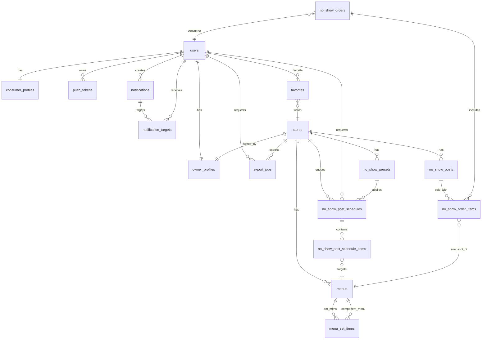

# Database & ERD (최종)

> 본 문서는 실제 운영 정보를 노출하지 않도록 **샘플/비식별** 형식으로 작성합니다.

## 핵심 테이블
- **users**: id(UUID), login_id, password_hash, role(CONSUMER/OWNER/ADMIN)
- **owner_profiles / consumer_profiles**: 사용자 상세(이름, 전화번호 등)
- **stores**: 매장 정보(+ PostGIS `geom` generated, 영업시간, 이미지 메타)
- **menus**: 매장 메뉴(가격, 설명, 이미지 메타, `status`, `type`)
- **menu_set_items**: 세트 메뉴와 단품 메뉴 구성 관계(`set_menu_id`, `component_menu_id`, `quantity`)
- **no_show_posts**: 노쇼 판매글(할인율, qty_remaining, expire_at, status)
- **no_show_post_history**: 변경 이력 저장
- **no_show_presets**: 매장 기본/사용자 정의 노쇼 프리셋(할인율, 지연 분)
- **no_show_post_schedules**: 지연 등록 대기 작업(예약 상태, start_at/expire_at, 게시 결과)
- **no_show_post_schedule_items**: 예약 작업별 메뉴/수량 스냅샷
- **no_show_orders**: 노쇼 주문 헤더(UUID PK, order_no, menu_names, paid_amount, payment_method, status)
- **no_show_order_items**: 주문 아이템 스냅샷(menu_name, quantity, unit_price, discount_percent, visit_time)
- **favorites**: 소비자 즐겨찾기(store_id, consumer_user_id)
- **push_tokens**: FCM 토큰(플랫폼/디바이스/토큰)
- **notifications / notification_targets**: 알림 발송 이력, 재시도/상태 관리
- **export_jobs**: 엑셀 내보내기 작업 이력(요청 해시, 상태, file_key, 만료)

## ERD (요약 Mermaid)

## 필드 메모 (주요)
- **no_show_orders.id**: UUID PK (마이그레이션으로 전환)
- **no_show_orders.order_no**: 표시용 주문번호 (예: `NS-YYYYMMDD-XXXXXX`)
- **no_show_orders.menu_names**: 주문 요약 텍스트
- **no_show_orders.payment_status**: PENDING/PAID/FAILED/REFUNDED
- **menus.status**: `menu_status` enum (`on_sale`, `sold_out`)
- **menus.type**: `menu_type` enum (`single`, `set`)
- **menu_set_items.quantity**: 1 이상, `UNIQUE(set_menu_id, component_menu_id)`
- **menu_set_items.component_menu_id**: 단품 메뉴만 참조, 삭제는 `RESTRICT`
- **no_show_presets.discount_percent**: 30~90
- **no_show_presets.visit_available_minutes**: 1~300
- **no_show_presets.sale_delay_minutes**: 0~300
- **no_show_post_schedules.status**: QUEUED/PROCESSING/PUBLISHED/CANCELLED/FAILED
- **no_show_post_schedules.start_at/expire_at**: 예약 게시 시작/만료 시점 (`start_at < expire_at`)
- **no_show_post_schedules.visit_available_minutes / sale_delay_minutes**: 예약 생성 시점 스냅샷 시간 정책
- **no_show_post_schedule_items**: 예약 당시 메뉴 구성 스냅샷(게시 시점 재검증용)
- **notification_targets.status**: QUEUED/SENT/FAILED 등 상태 관리 (상세는 구현 정책 기준)
- **stores.geom**: `lat/lon` 기반 GENERATED column (PostGIS)
- **export_jobs.request_hash**: 동일 요청 제어용 SHA-256
- **export_jobs.file_key**: 엑셀 파일 객체 스토리지 경로

## 메뉴 모델 메모
- 새 메뉴는 기본적으로 `type=single`, `status=sold_out` 으로 생성됩니다.
- 기존 메뉴 마이그레이션 시 `type=single`, `status=on_sale` 로 백필합니다.
- 세트 메뉴의 실제 판매 가능 여부는 저장 상태가 아니라 구성 단품 상태를 포함한 계산 결과 `effectiveStatus` 로 판단합니다.
- 세트 메뉴는 같은 매장의 단품 메뉴만 포함할 수 있고, 최소 1개 이상이어야 하며 자기 자신을 참조할 수 없습니다.
