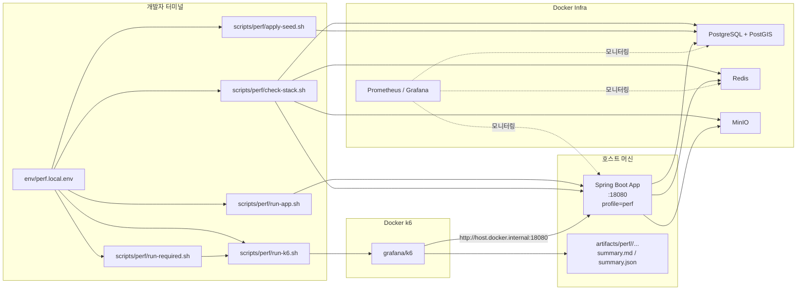
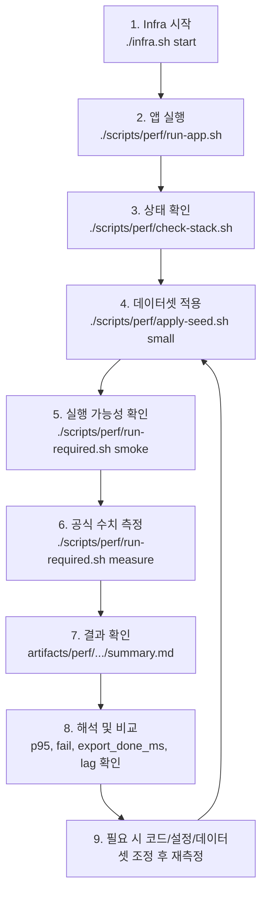

# k6 기반 성능 측정 체계

이 문서는 `dandi-onna-be` 에서 **직접 재현 가능한 성능 수치**를 남기기 위한 기준 문서다. 목표는 단순히 “빠르다”를 주장하는 것이 아니라, 아래 네 가지를 항상 함께 남기는 것이다.

1. 무엇을 측정했는가
2. 어떤 코드 경로와 인프라를 통과했는가
3. 어떤 데이터 규모에서 측정했는가
4. 평균/p95/p99 와 비동기 완료 시간 같은 핵심 수치가 얼마였는가

공식 측정 도구는 `k6` 로 통일한다. 로컬에 `k6` 바이너리가 없어도 되도록 Docker 기반 래퍼를 사용한다. 성능 측정 기준 앱 포트는 호스트 `18080` 이고, Docker 내부 k6 는 `http://host.docker.internal:18080` 으로 접근한다.

## 1. 왜 이 체계를 도입하는가

이번 작업의 목표는 두 가지다.

- **이력서/포트폴리오용 수치 확보**
  - 예: `로컬 Docker 환경에서 매장 10,000건 기준 GET /api/v1/home/stores p95 140ms 측정`
  - 예: `주문 50,000건 기준 비동기 매출 export 완료 시간 평균 2.8초 측정`
- **실제 병목 확인용 수치 확보**
  - 조회 API는 응답시간 분포를 본다.
  - 쓰기/비동기 흐름은 요청 응답과 전체 완료 시간을 분리해 본다.

문서를 설명형으로 유지하는 이유도 여기에 있다. 성능 수치는 “명령어만 적어둔 메모”가 아니라, **무엇을 왜 재고 어떻게 해석하는지** 까지 같이 남아야 나중에 다시 써먹을 수 있다.

## 2. 측정 원칙

- 실제 API 호출만 기록한다. 추정치나 체감 속도는 공식 수치로 쓰지 않는다.
- 환경을 같이 적는다. 앱 포트, Docker 인프라, seed 규모, profile(`smoke`/`measure`)을 같이 남긴다.
- 워밍업과 본 측정을 분리한다. `smoke` 는 실행 가능성 검증, `measure` 는 공식 수치 확보용이다.
- 조회 API와 비동기 API를 같은 방식으로 해석하지 않는다.
  - 조회 API: 평균/p95/p99/fail
  - 비동기 API: ACK 시간 + DONE 시간 + lag
- `image_key` 가 있으면 presign URL 생성 비용도 실제 응답시간에 포함된다고 본다.
- 1차 작업에서는 profiler/flame graph/query count 는 하지 않는다. 이번 단계는 **공식 측정 체계와 재현 가능한 숫자 확보** 가 목적이다.

## 3. 측정 대상

### 3-1. 필수 5개

| API | 왜 측정하는가 | 핵심 코드 경로 | 기록할 핵심 수치 |
| --- | --- | --- | --- |
| `GET /api/v1/home/stores` | 소비자 핵심 조회. PostGIS 거리 정렬과 매장 이미지 presign 비용이 함께 들어간다. | `home/controller/HomeController`, `home/service/HomeStoreService`, `store/repository/StoreRepository#findNearbyStores` | avg, p95, p99, fail |
| `POST /api/v1/orders` | 소비자 핵심 쓰기. 재고 검증, 주문/주문아이템 저장, 알림 enqueue 비용이 들어간다. | `noshow_order/controller/NoShowOrderConsumerController`, `noshow_order/service/NoShowOrderConsumerService` | avg, p95, fail |
| `POST /api/v1/owner/sales/export` + `GET /api/v1/owner/sales/export/{jobId}` | 요청 응답과 비동기 완료 시간을 분리해서 볼 수 있다. | `noshow_order/controller/OwnerSalesExportController`, `export_job/service/ExportJobService`, `export_job/worker/ExportJobDispatchWorker` | `export_ack_ms`, `export_done_ms`, fail |
| `GET /api/v1/owner/menus` | 사장님 운영 화면 체감 속도. 메뉴 이미지 presign 과 세트 구성 계산이 포함된다. | `menu/controller/MenuController`, `menu/service/MenuService` | avg, p95, p99, fail |
| `GET /api/v1/stores/{storeId}/no-show-posts` | 소비자 매장 상세 진입 성능. 매장/메뉴 이미지 presign, favorite 여부 조회가 포함된다. | `store/controller/StoreConsumerController`, `store/service/StoreConsumerService` | avg, p95, p99, fail |

### 3-2. 2순위 5개

| API/기능 | 왜 포함하는가 | 측정 방식 |
| --- | --- | --- |
| `GET /api/v1/home` | 앱 첫 화면 체감 속도 보강용 | avg, p95, fail |
| `POST /api/v1/owner/menu-images/temp/presign` + direct `PUT` + `POST /confirm` | MinIO presign-confirm 왕복 측정 | presign, put, confirm, e2e |
| `POST /api/v1/owner/no-show-post-schedules` + publish lag | 예약 등록이 실제 게시까지 얼마나 늦는지 측정 | create ms, publish lag |
| `PostExpiryScheduler` | 만료 시간이 지난 글이 목록에서 사라지기까지 지연 측정 | expiry lag proxy |
| `GET /api/v1/owner/sales` | export 이전의 기본 매출 목록 조회 성능 확인 | avg, p95, fail |

### 3-3. 이번 1차에서 제외하는 항목

| 제외 대상 | 왜 이번 단계에서 제외하는가 |
| --- | --- |
| admin/favorites/push token/store CRUD | 핵심 성능 수치보다 우선순위가 낮다. |
| FCM end-to-end delivery time | 외부 인프라와 디바이스 상태 영향이 커서 결과 일관성이 낮다. |
| ELK 검색 성능 | 현재 백엔드 핵심 API 성능 체계 구축이 우선이다. |
| JWT/JWE microbench, Redis microbench, repository microbench | 실제 사용자 요청의 end-to-end 시간을 우선 확보한다. |
| profiler/flame graph/query count | 원인 분석 단계의 도구이고, 이번 단계 목표는 공식 측정 체계 정립이다. |

## 4. 실행 환경과 전제

### 4-1. Infra

PostgreSQL, Redis, MinIO와 관측 도구는 별도 Infra 저장소를 사용한다. 로컬 경로를 고정하지 않고 환경변수로 지정한다.

```bash
export DANDI_INFRA_DIR=/path/to/dandi-infra
cd "$DANDI_INFRA_DIR"
./infra.sh start
```

현재 사용 가능한 인프라는 다음과 같다.

- PostgreSQL(PostGIS): `Infra/postgresql/docker-compose.yml`
- Redis: `Infra/redis/docker-compose.yml`
- MinIO: `Infra/minio/docker-compose.yml`
- Prometheus/Grafana: `Infra/prometheus/docker-compose.yml`

### 4-2. 앱 실행

앱은 Docker가 아니라 호스트에서 실행한다. Docker는 Infra 와 k6 실행에만 사용한다.

```bash
git clone https://github.com/goorm-ynot/dandi-onna-be.git
cd dandi-onna-be
export DANDI_BACKEND_DIR="$PWD"
cp env/perf.local.env.example env/perf.local.env

# env/perf.local.env 수정
# - SERVER_PORT=18080
# - MINIO_ENDPOINT=http://localhost:19090
# - MINIO_PUBLIC_ENDPOINT=http://host.docker.internal:19090
# - JWE/FIREBASE/DB/REDIS 실제 값

./scripts/perf/run-app.sh
```

기본 실행 프로필은 `perf` 이다. `src/main/resources/application-perf.yaml` 에 rate limit override, logging level, scheduler interval 같은 성능 측정용 기본 정책이 들어 있다.

`MINIO_PUBLIC_ENDPOINT` 를 `host.docker.internal` 로 두는 이유는, presigned URL 을 사용하는 주체가 Docker 내부의 k6 이기 때문이다. 컨테이너 안에서 `localhost` 는 호스트가 아니라 컨테이너 자신을 가리킨다.

### 4-3. 검증 아키텍처 한눈에 보기

이번 성능 측정은 “앱 코드만 빠른가”를 보는 작업이 아니다. 실제로는 아래 네 가지가 함께 검증된다.

1. 앱이 성능 측정용 설정으로 정상 부팅되는가
2. DB/Redis/MinIO 같은 외부 의존성을 통과한 end-to-end 응답시간이 얼마나 되는가
3. 같은 seed 와 같은 실행 절차로 다시 돌려도 비슷한 결과를 재현할 수 있는가
4. 결과가 `summary.md`, `summary.json` 으로 남아 나중에 비교 가능한가

아래 다이어그램은 이 검증 구조를 한 장으로 보여준다.



이 그림을 초보자 기준으로 풀면 다음과 같다.

- `env/perf.local.env`
  - 성능 측정에 필요한 실제 값이 들어 있는 파일이다.
  - DB 주소, Redis 비밀번호, MinIO 주소, JWE 시크릿, 앱 포트 같은 값이 여기서 정해진다.
- `run-app.sh`
  - `.env` 파일을 읽고 `perf` 프로필로 앱을 실행한다.
  - 따라서 사용자는 `export` 를 여러 줄 직접 치지 않아도 된다.
- `check-stack.sh`
  - “지금 정말 측정 가능한 상태인가”를 확인한다.
  - Docker 컨테이너가 떠 있는지, 앱 health check 가 통과하는지 본다.
- `apply-seed.sh`
  - Postgres에 성능 측정용 데이터를 넣는다.
  - 같은 `small`, `medium`, `large` 데이터셋을 반복 적용할 수 있어서 측정 재현성이 좋아진다.
- `run-k6.sh` / `run-required.sh`
  - 실제 HTTP 성능 측정을 수행한다.
  - `run-required.sh` 는 필수 5개 시나리오를 묶어서 돌리는 편의 스크립트이고, 실제 측정 엔진은 `run-k6.sh` 와 `grafana/k6` 컨테이너다.
- `artifacts/perf/...`
  - 측정 결과가 저장되는 위치다.
  - 즉석 출력만 보고 끝내지 않고, 나중에 다시 비교할 수 있는 근거 파일을 남긴다.

중요한 점은, 이 구조가 단순한 “코드 단위 벤치마크”가 아니라는 것이다. 실제 HTTP 요청이 앱을 지나 DB/Redis/MinIO까지 연결된 상태에서 측정되므로, 사용자가 체감하는 경로와 더 가깝다.

### 4-4. 한 번의 검증 사이클

아래 다이어그램은 “도커가 켜져 있는 상태에서 실제로 어떤 순서로 확인하고 측정하는지”를 보여준다.



이 흐름의 핵심은 “바로 measure 로 가지 않는다”는 점이다.

- `smoke`
  - API가 실제로 동작하는지 확인하는 단계다.
  - 로그인 실패, 잘못된 seed, 잘못된 포트, 500 에러를 먼저 잡는다.
- `measure`
  - smoke 가 통과한 뒤 공식 수치를 남기는 단계다.
  - 이력서/포트폴리오용 숫자는 이 단계 결과를 기준으로 적는다.

즉, 같은 명령을 아무 생각 없이 반복하는 것이 아니라, “환경 확인 -> 데이터셋 고정 -> 실행 가능성 확인 -> 공식 측정” 순서로 검증의 신뢰도를 쌓는 구조다.

## 5. 계정과 기본 데이터셋 전략

### 5-1. 소비자 계정

- 기본 로그인: `Customer1 / 111111`
- 근거: `src/main/resources/db/migration/V16__seed_consumer_test_account.sql`

### 5-2. 사장님 계정

- 성능 시나리오 기본값: `PERF_OWNER_MAIN / 111111`
- fallback: `CEO1 / 111111`
- 이유:
  - `CEO1` 는 수동 테스트용으로 쓰이지만, 성능 측정용 대량 데이터는 `PERF_OWNER_MAIN` 전용 store/menu/order seed 에 묶는 편이 반복 측정에 안전하다.
  - `scripts/perf/lib/auth.js` 는 기본적으로 `PERF_OWNER_MAIN` 로그인 후, 필요하면 `CEO1` 으로 fallback 한다.

### 5-3. 데이터셋 규모

`scripts/perf/seeds/common.sql` 에 `perf_seed_dataset()` 함수가 있고, `small.sql`, `medium.sql`, `large.sql` 은 그 함수를 다른 규모로 호출한다.

| dataset | 총 매장 수 | 메인 스토어 메뉴 수 | 메인 스토어 open post 수 | export 주문 수 | 의도 |
| --- | ---: | ---: | ---: | ---: | --- |
| `small` | 100 | 100 | 30 | 1,000 | smoke 와 빠른 구조 점검 |
| `medium` | 1,000 | 300 | 60 | 10,000 | 중간 규모 병목 확인 |
| `large` | 10,000 | 1,000 | 120 | 50,000 | 이력서용 수치와 한계 확인 |

### 5-4. seed 구조

- `reset.sql`: `PERF_` 네임스페이스 데이터만 정리한다.
- `small.sql`, `medium.sql`, `large.sql`: 내부적으로 `perf_seed_dataset()` 을 호출해 메인 스토어 + 보조 스토어 + 메뉴 + open posts + export 주문을 생성한다.
- 메인 스토어는 `PERF Main Store` 라는 이름으로 생성되며, owner 시나리오와 주문/상세 조회 시나리오의 기준 매장 역할을 한다.
- `PERF Expiry Probe` 라는 단품 메뉴/게시글을 별도로 넣어 `PostExpiryScheduler` 반영 시간을 측정한다.

## 6. 실행 흐름

### 6-1. seed 적용

```bash
./scripts/perf/check-stack.sh
./scripts/perf/apply-seed.sh reset
./scripts/perf/apply-seed.sh small
```

기본적으로 `small/medium/large.sql` 자체가 내부에서 cleanup 을 수행하므로 단독 실행도 가능하지만, 공식 절차는 `reset -> dataset` 순서다.

### 6-2. k6 실행

```bash
# 필수 5개 묶음
./scripts/perf/run-required.sh smoke
./scripts/perf/run-required.sh measure

# 개별 실행
./scripts/perf/run-k6.sh home-stores smoke
./scripts/perf/run-k6.sh home-stores measure
./scripts/perf/run-k6.sh orders measure
./scripts/perf/run-k6.sh sales-export measure
./scripts/perf/run-k6.sh owner-menus measure
./scripts/perf/run-k6.sh store-no-show-posts measure
```

`run-k6.sh` 는 내부적으로 다음을 수행한다.

- `grafana/k6` 컨테이너 실행
- `--add-host=host.docker.internal:host-gateway` 추가
- `env/perf.local.env` 가 있으면 자동 로드
- `scripts/perf/scenarios/<scenario>.js` 실행
- 결과를 `artifacts/perf/<timestamp>/<scenario>/<profile>/summary.{json,md}` 에 저장

## 6-3. Docker 가 다 켜져 있을 때 실제 테스트 순서

초보자 기준으로 보면 아래 순서만 기억하면 된다.

1. `./infra.sh start` 로 Postgres/Redis/MinIO/Prometheus/Grafana 를 켠다.
2. `./scripts/perf/run-app.sh` 로 앱을 `perf` 프로필로 켠다.
3. `./scripts/perf/check-stack.sh` 로 컨테이너와 앱 health 를 확인한다.
4. `./scripts/perf/apply-seed.sh small` 로 데이터를 넣는다.
5. `./scripts/perf/run-required.sh smoke` 로 필수 5개 API 가 실제로 도는지 확인한다.
6. 문제가 없으면 `./scripts/perf/run-required.sh measure` 로 공식 수치를 남긴다.

확인 포인트는 세 가지다.

- `./scripts/perf/check-stack.sh` 가 `[OK]` 로 끝나는지
- `artifacts/perf/.../summary.md` 가 생성되는지
- `summary.md` 안의 fail rate 가 `0.00%` 인지

## 7. 시나리오별 측정 기준

### 7-1. 필수 시나리오

#### `home-stores`

- 스크립트: `scripts/perf/scenarios/home-stores.js`
- 준비:
  - 소비자 로그인
  - 좌표 `lat=37.3940`, `lon=127.1100`
- 측정:
  - `GET /api/v1/home/stores?lat&lon&page=0&size=20`
- 남길 수치:
  - avg, p95, p99, fail
- 해석:
  - p95 가 높으면 PostGIS 정렬 또는 presign URL 생성 비용이 튈 가능성이 높다.

#### `orders`

- 스크립트: `scripts/perf/scenarios/orders.js`
- 준비:
  - 소비자 로그인
  - `home-stores -> store-no-show-posts` discovery 로 대상 store/post 찾기
  - 같은 `expireAt` 을 가진 게시글 묶음으로 주문 payload 생성
- 측정:
  - `POST /api/v1/orders`
- 남길 수치:
  - avg, p95, fail
- 해석:
  - 실패율이 높으면 재고 소진, visitTime 정렬 실패, 금액 불일치 같은 준비 데이터 문제도 같이 의심해야 한다.

#### `sales-export`

- 스크립트: `scripts/perf/scenarios/sales-export.js`
- 준비:
  - owner 로그인
  - 최근 `N`일(`PERF_SALES_WINDOW_DAYS`) 기준 날짜 범위
- 측정:
  - `POST /api/v1/owner/sales/export`
  - `GET /api/v1/owner/sales/export/{jobId}` polling
- 남길 수치:
  - `export_ack_ms`
  - `export_done_ms`
- 해석:
  - ACK 는 빠르지만 DONE 이 느리면 Excel 생성/업로드/Redis worker 구간이 병목일 가능성이 높다.

#### `owner-menus`

- 스크립트: `scripts/perf/scenarios/owner-menus.js`
- 준비:
  - owner 로그인
- 측정:
  - `GET /api/v1/owner/menus?page=0&size=20`
- 남길 수치:
  - avg, p95, p99, fail
- 해석:
  - 이미지가 많은 데이터셋에서 p95 가 튀면 presign 생성 비용도 같이 봐야 한다.

#### `store-no-show-posts`

- 스크립트: `scripts/perf/scenarios/store-no-show-posts.js`
- 준비:
  - 소비자 로그인
  - `home-stores` discovery 로 대상 store 선택
- 측정:
  - `GET /api/v1/stores/{storeId}/no-show-posts`
- 남길 수치:
  - avg, p95, p99, fail
- 해석:
  - 매장 이미지 + 메뉴 이미지 + favorite 조회가 묶여 있으므로 상세 진입 체감 지표로 적합하다.

### 7-2. 2순위 시나리오

| scenario | 스크립트 | 기록 지표 | 비고 |
| --- | --- | --- | --- |
| `home` | `scripts/perf/scenarios/home.js` | avg, p95, fail | 오늘 주문 3건 조회 |
| `menu-image-temp-upload` | `scripts/perf/scenarios/menu-image-temp-upload.js` | presign, put, confirm, e2e | MinIO direct PUT 포함 |
| `no-show-schedule` | `scripts/perf/scenarios/no-show-schedule.js` | create ms, publish lag | seed 기본 preset 의 `saleDelayMinutes=0` 전제 |
| `post-expiry` | `scripts/perf/scenarios/post-expiry.js` | expiry lag proxy | `PERF Expiry Probe` 가 목록에서 사라질 때까지 측정 |
| `owner-sales` | `scripts/perf/scenarios/owner-sales.js` | avg, p95, fail | 날짜 입력 형식은 `yyyy-MM-dd` |

## 8. 결과 파일과 해석 기준

각 시나리오는 다음 두 파일을 남긴다.

- `summary.json`: 전체 raw metrics 와 실행 metadata
- `summary.md`: 사람이 읽기 쉬운 결과 요약

공통으로 같이 남기는 정보:

- scenario 이름
- profile(`smoke`/`measure`)
- dataset(`small`/`medium`/`large`)
- base URL
- endpoint 목록
- `http_req_duration`
- `http_req_failed`
- 시나리오별 custom metric

### 해석 기준

- `avg` 는 전체 평균이다. 대체로 빠르지만 가끔 튀는 문제는 avg 에 잘 안 보인다.
- `p95` 는 느린 상위 5% 구간을 본다. 체감 성능과 병목 판단에 가장 자주 쓴다.
- `p99` 는 아주 느린 꼬리 구간이다. 간헐적 튐이 있는지 볼 때 유용하다.
- 비동기 시나리오는 `ACK` 와 `DONE` 을 분리해서 본다.
  - ACK 가 빠르고 DONE 이 느리면 worker/DB/파일 생성 쪽을 봐야 한다.
- `post-expiry` 는 “consumer 목록에서 사라질 때까지의 지연”을 scheduler 반영 시간의 proxy 로 해석한다.

## 9. 결과 템플릿

### 9-1. 조회 API 템플릿

| 항목 | 값 |
| --- | --- |
| scenario | |
| 환경 | 예: host app:18080 + Docker(Postgres/Redis/MinIO/k6) |
| dataset | 예: medium |
| 데이터 규모 | 예: stores 1,000 / open posts 1,000 |
| 요청 | 예: `GET /api/v1/home/stores?page=0&size=20` |
| 평균 | |
| p95 | |
| p99 | |
| 실패율 | |
| 해석 | |
| 이력서 문장 후보 | |

### 9-2. 비동기/흐름 API 템플릿

| 항목 | 값 |
| --- | --- |
| scenario | |
| 환경 | 예: host app:18080 + Redis worker + MinIO |
| dataset | 예: large |
| 데이터 규모 | 예: orders 50,000 / items 100,000 |
| 요청 | 예: `POST /api/v1/owner/sales/export` |
| ACK 시간 | |
| DONE 시간 | |
| polling timeout | |
| 실패율 | |
| 해석 | |
| 이력서 문장 후보 | |

### 9-3. 이력서 문장 규칙

- 좋은 예:
  - `로컬 Docker 환경에서 매장 10,000건 기준 GET /api/v1/home/stores p95 140ms 를 측정했습니다.`
  - `주문 50,000건 기준 비동기 매출 export 완료 시간 평균 2.8초를 측정했습니다.`
- 피해야 할 예:
  - `성능을 개선했습니다.`
  - `대용량에서도 빠릅니다.`

## 10. 이번 구현에서 맞춘 작은 불일치

- `POST /api/v1/owner/sales/export` 요청 DTO 는 원래 `yyyy-MM-dd` 를 검증했는데, 서비스는 `yyyy.MM.dd` 를 파싱하고 있었다.
- `GET /api/v1/owner/sales` 도 `yyyy.MM.dd` 를 기대하고 있었다.
- 현재 구현에서는 두 API 모두 **입력 날짜 형식을 `yyyy-MM-dd` 로 통일** 했다.
- `PostExpiryScheduler` 주기는 `app.noshow.post-expiry.poll-interval-ms` 로 외부화했다.

## 11. 실행 체크리스트

1. Infra 를 올린다.
2. 앱을 호스트 `18080` 으로 실행한다.
3. `MINIO_PUBLIC_ENDPOINT` 를 `http://host.docker.internal:19090` 으로 맞춘다.
4. rate limit override env 를 올린다.
5. `./scripts/perf/apply-seed.sh <small|medium|large>` 로 데이터셋을 준비한다.
6. `./scripts/perf/run-k6.sh <scenario> smoke` 로 먼저 실행 가능성을 확인한다.
7. `./scripts/perf/run-k6.sh <scenario> measure` 로 공식 수치를 남긴다.
8. `artifacts/perf/.../summary.md` 를 읽고 템플릿에 옮긴다.
