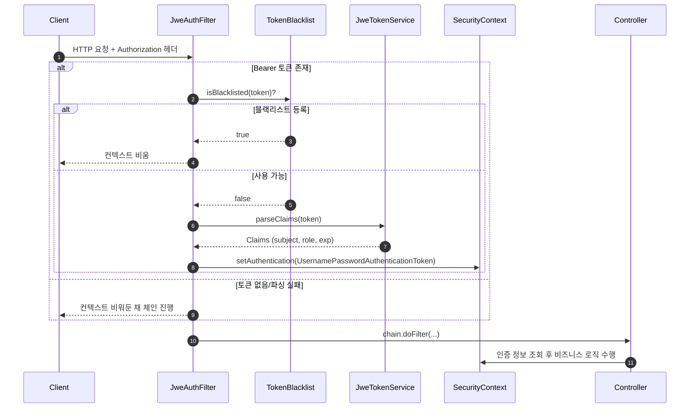

# Security Flow

이 문서는 `src/main/java/com/mvp/v1/dandionna/config/Security` 패키지의 구성 요소가 어떻게 협력하여 요청을 보호하는지 설명합니다.

## 구성 요소
- `JwtProps.java` — `application.yaml` 의 `security.jwt`/`security.jwe` 값을 타입 안정성 있게 보관합니다.
- `SecurityBeans.java` — 암호 키(`SecretKey`)와 AEAD 알고리즘(`AeadAlgorithm`)을 빈으로 노출하여 나머지 계층이 설정 파싱과 분리됩니다.
- `JweTokenService.java` — Access/Refresh 토큰 발급과 검증을 전담하는 순수 서비스 계층입니다.
- `JweAuthFilter.java` — HTTP 요청에서 Bearer 토큰을 추출하고 `SecurityContext` 에 인증 객체를 주입합니다.
- `TokenBlacklistService.java` — Redis 로 Access/Refresh 블랙리스트 키를 관리해 토큰 무효화를 강제합니다.
- `PushTokenService`/`Controller` — 디바이스별 FCM 토큰을 저장해 푸시 알림 전송 시 기기 식별 정보를 사용합니다. Re-authentication 시에도 바디로 전달된 토큰을 비교해 불필요한 업데이트를 줄입니다.
- `SecurityConfig.java` — Spring Security 체인을 구성하고, 필터를 적절한 위치에 삽입합니다.

## 요청 라이프사이클
1. 클라이언트가 `Authorization: Bearer <JWE>` 헤더와 함께 HTTP 요청을 보냅니다.
2. `SecurityConfig` 가 등록한 `JweAuthFilter` 가 가장 먼저 헤더를 확인합니다.
3. 블랙리스트에 등록된 토큰이면 즉시 체인을 넘기고 인증을 세팅하지 않습니다.
4. 나머지 토큰은 `JweTokenService#parseClaims` 로 복호화/검증 후 `Claims` 를 돌려받습니다.
5. 필터는 `Claims` 에서 사용자 ID/역할을 꺼내 `UsernamePasswordAuthenticationToken` 을 만들고 `SecurityContextHolder` 에 저장합니다.
6. 체인이 계속 진행되면서 컨트롤러/서비스 층은 `SecurityContext` 를 읽어 인증된 사용자로 로직을 실행합니다.
7. 토큰이 없거나 검증 실패 시 컨텍스트는 비워두고, 이후 계층에서 `401/403` 처리를 담당합니다.

## 토큰 발급 흐름
1. 로그인 시 `JweTokenService#issueAccessToken` 이 단기 Access 토큰을, `issueRefreshToken` 이 장기 Refresh 토큰을 발급합니다.
2. 두 토큰 모두 `JwtProps.jwt.*` 값을 사용해 만료 시간과 발급자를 일관되게 설정하고, `SecurityBeans` 가 제공한 키/알고리즘으로 암호화합니다.

## Mermaid Sequence

이 다이어그램과 설명은 각 코드 파일의 주석과 연동되어 있으므로, 보안 흐름을 파악할 때 함께 참고하면 됩니다.
## Refresh & Logout Notes

- **Refresh 토큰 전달 방식**: `/v1/api/auth/token/refresh` 는 인증 헤더가 아닌 DTO 바디로 리프레시 토큰을 받는다. Access 토큰과 구분된 채널을 사용해 필터 충돌을 피하고, httpOnly 쿠키로 전환할 여지를 남기기 위함이다.
- **리프레시 토큰 블랙리스트**: 새 토큰 발급 시 기존 토큰을 블랙리스트에 올려 재사용을 방지한다. 요청 시 블랙리스트로 먼저 필터링한다.
- **로그아웃**: Access/Refresh 둘 다 남은 TTL 만큼 Redis 에 저장해 강제 만료된다. 필터는 Access 토큰 블랙리스트를 먼저 검사한다.

## Push Token Registration

- `/v1/api/push/tokens` 는 Access 토큰 인증 후 바디 DTO(`PushTokenRegisterRequest`) 로 `platform/deviceId/fcmToken/userAgent` 를 받고 `(user, platform, device)` 단위로 upsert 한다.
- 기존 토큰과 user-agent 가 동일하면 `last_seen_at` 만 갱신하고, 변화가 있으면 새 토큰을 저장한다. 이로써 빈번한 재등록에서 DB 쓰기량을 줄인다.
